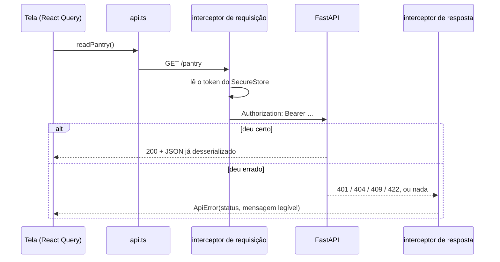

# Integração app ↔ API — como o aplicativo consome o backend

A DÉCADA são **dois sistemas separados**, não um. O aplicativo não tem banco de
dados: tudo que ele mostra na tela veio de uma chamada HTTP, e tudo que a pessoa
decide volta por outra. Este documento diz por onde essa conversa passa.

| | Quem é | Como fala |
|---|---|---|
| Cliente | React Native + Expo, TypeScript | axios sobre HTTP, corpo em JSON |
| Servidor | FastAPI + Pydantic v2, Python | 23 rotas de domínio, autenticadas por JWT, mais `/health` |
| Endereço | `EXPO_PUBLIC_API_URL`, em `mobile/.env` | `http://localhost:8000` quando não definido |

O endereço não é fixo no código de propósito: `localhost` no emulador Android e
no celular físico aponta para o próprio aparelho, não para a máquina que roda o
backend.

## Onde isso mora no código

| Arquivo | Responsabilidade |
|---|---|
| [`mobile/src/services/http.ts`](../mobile/src/services/http.ts) | A instância do axios e os dois interceptors. **Política de comunicação** |
| [`mobile/src/services/api.ts`](../mobile/src/services/api.ts) | Uma função por rota do backend, e nada mais |
| [`mobile/src/services/session.ts`](../mobile/src/services/session.ts) | O token, guardado no Keychain/Keystore pelo `expo-secure-store` |
| [`mobile/src/services/config.ts`](../mobile/src/services/config.ts) | O endereço da API |
| [`mobile/src/types/api.ts`](../mobile/src/types/api.ts) | O contrato: os tipos que o backend devolve |

A separação entre os dois primeiros é o ponto: `api.ts` descreve **o quê**, e
`http.ts` resolve **como**. Nenhuma tela importa axios.

## O caminho de uma chamada



## Os dois interceptors

**O de requisição põe o token.** Toda chamada sai autenticada, exceto as que
ainda não têm token — login e cadastro, marcadas com `anonymous`. O token é
lido do armazenamento cifrado do sistema na hora do envio, nunca de uma
variável em memória.

**O de resposta traduz o erro.** Qualquer falha chega às telas como `ApiError`,
com `status` e uma mensagem que pode ser exibida. A tela nunca vê um erro do
axios, e por isso não precisa saber que existe axios.

Isso é o que a troca do `fetch` por axios comprou: antes, token e tratamento de
erro moravam dentro de uma função escrita à mão, e cada caminho novo tinha de
repetir os dois. Agora são política da instância — e veio de graça o **tempo
limite**, que não existia antes (15s nas chamadas, 60s no envio do PDF; sem
ele, rede ruim deixava a tela esperando para sempre).

## O que o app consome

Das 23 rotas de domínio, o app consome 22. A que falta é
`GET /pantry/{item_id}/candidates` — a tela de despensa resolve a busca de
produto por `/products/search`. O `/health` existe para saber se o servidor está
de pé; o app não o usa.

### Conta

| Método | Rota | Função em `api.ts` |
|---|---|---|
| POST | `/auth/register` | `register` |
| POST | `/auth/login` | `login` |
| GET | `/auth/me` | `readAccount` |
| DELETE | `/auth/me` | `deleteAccount` |

### Plano alimentar

| Método | Rota | Função |
|---|---|---|
| POST | `/meal-plans` | `importMealPlan` — multipart, o PDF |
| GET | `/meal-plans` | `readMealPlans` |
| GET | `/meal-plans/{id}` | `readMealPlan` |
| GET | `/meal-plans/{id}/items/{item}/candidates` | `readCandidates` |
| POST | `/meal-plans/{id}/items/{item}/confirmation` | `confirmItem` |

### Lista de compras

| Método | Rota | Função |
|---|---|---|
| POST | `/meal-plans/{id}/shopping-lists` | `generateShoppingList` |
| GET | `/meal-plans/{id}/shopping-lists` | `readShoppingLists` |
| GET | `/shopping-lists/{id}` | `readShoppingList` |
| POST | `/shopping-lists/{id}/simulation` | `simulateShoppingList` |
| POST | `/shopping-lists/{id}/items` | `addExtraItem` |
| DELETE | `/shopping-lists/{id}/items/{item}` | `removeShoppingListItem` |
| PATCH | `/shopping-lists/{id}/items/{item}` | `setItemPurchased` |

### Despensa, catálogo e receitas

| Método | Rota | Função |
|---|---|---|
| GET | `/pantry` | `readPantry` |
| POST | `/pantry` | `addPantryItem` |
| PATCH | `/pantry/{id}` | `updatePantryItem` |
| DELETE | `/pantry/{id}` | `removePantryItem` |
| GET | `/products/search` | `searchProducts` |
| GET | `/recipes/suggestions` | `readRecipeSuggestions` |

## Erro: o que cada status significa na tela

| Status | O que é | O que a tela faz |
|---|---|---|
| `0` | O servidor não respondeu — rede fora, ou tempo esgotado | "não foi possível falar com o servidor". Não é bug do app nem do backend |
| `401` | Sessão expirada, token adulterado ou conta excluída | Derruba a sessão e volta para o login |
| `404` | Recurso que não existe **ou que é de outra pessoa** | Trata como inexistente |
| `409` | Conflito — produto que já está na lista | Mostra a mensagem do servidor |
| `422` | Regra de negócio ou validação — PDF sem texto, item da prescrição que não pode sair da lista | Mostra a mensagem do servidor |

O `0` não é um status HTTP: é a marca de que não houve resposta. Sem ele, "o
servidor recusou" e "o servidor não respondeu" chegariam iguais na tela.

O `404` para recurso de outra pessoa é decisão de projeto, não descuido:
responder `403` confirmaria que o recurso existe. Ver
[`lgpd.md`](lgpd.md) e a decisão 10 do `CLAUDE.md`.

A mensagem vem do campo `detail` da FastAPI. Quando o `detail` é a lista de
erros de validação do Pydantic, o cliente extrai o primeiro `msg`.

## O envio do PDF é o caso especial

É a única chamada que não vai em JSON: o plano alimentar sobe como
`multipart/form-data`. O formato do arquivo **difere entre web e nativo** —
no React Native vai um descritor `{ uri, name, type }`; no navegador é preciso
ler o conteúdo e enviar um `Blob`. Errar isso faz o servidor receber a string
`"[object Object]"` e recusar o envio.

O token continua vindo do interceptor, como em qualquer outra chamada.

## Como verificar que funciona

São duas camadas, e elas provam coisas diferentes.

**Contrato** — [`mobile/src/services/__tests__/api.test.ts`](../mobile/src/services/__tests__/api.test.ts),
15 casos sobre um adaptador falso do axios. Não precisa de servidor:

```bash
cd mobile && npm test
```

**Ponta a ponta** — [`mobile/e2e/smoke.e2e.ts`](../mobile/e2e/smoke.e2e.ts),
o cliente real contra o backend real. Precisa do Postgres e do uvicorn de pé:

```bash
docker compose up -d
cd backend && .venv/bin/python -m app.seeds && .venv/bin/uvicorn app.main:app &
cd ../mobile && npm run test:smoke
```

Ele percorre o caminho inteiro e cria uma conta própria, que apaga no último
passo: cadastro → `/auth/me` → PDF do plano por multipart → confirmação item a
item → lista de compras com custo → busca no catálogo → despensa → receitas →
o `204` do DELETE → o `401` da senha errada → exclusão da conta.

Fica fora da suíte comum de propósito: sem servidor de pé ele falharia, e
`npm test` tem de poder rodar sozinho.
