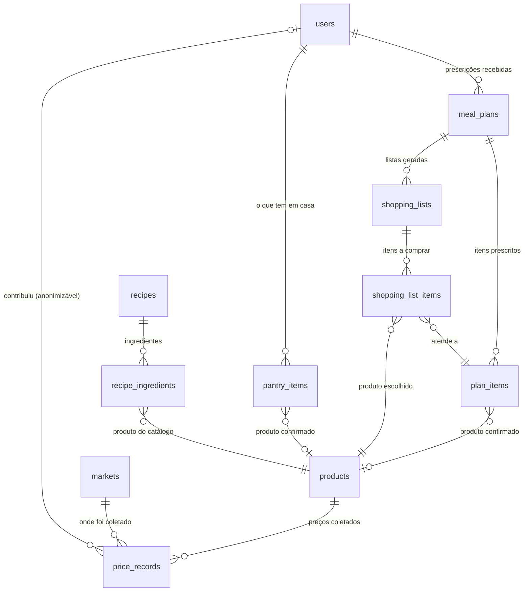

# Modelo de dados

Doze tabelas, três grupos. O que separa os grupos é a quem o dado pertence —
e isso decide o que acontece quando alguém pede exclusão.

| Grupo | Tabelas | De quem é |
|---|---|---|
| Pessoa | `users`, `meal_plans`, `plan_items`, `pantry_items`, `shopping_lists`, `shopping_list_items` | do usuário — sai junto com ele |
| Catálogo | `products`, `markets`, `recipes`, `recipe_ingredients` | de ninguém — é referência compartilhada |
| Preço | `price_records` | do mercado, não de quem passou no caixa |



## Por que cada regra de exclusão é o que é

A coluna `ON DELETE` não é detalhe de implementação: é onde a política de dados
do projeto vira código. `tests/test_models.py` trava cada uma delas.

| De → para | Regra | Motivo |
|---|---|---|
| `meal_plans` → `users` | `CASCADE` | Plano é dado de saúde. Sai com a pessoa. |
| `plan_items` → `meal_plans` | `CASCADE` | Item não existe sem o plano. |
| `pantry_items` → `users` | `CASCADE` | Despensa é dado pessoal. |
| `shopping_lists` → `meal_plans` | `CASCADE` | Lista deriva do plano. |
| `price_records` → `users` | `SET NULL` | Preço é informação sobre o mercado. Anonimizado, deixa de ser dado pessoal e continua servindo a média da região. |
| `plan_items` → `products` | `RESTRICT` | Apagar um produto do catálogo deixaria uma confirmação apontando para nada. |
| `shopping_list_items` → `products` | `RESTRICT` | Mesma razão, e a lista guarda o preço daquele produto. |
| `recipe_ingredients` → `products` | `RESTRICT` | Receita sem ingrediente não é receita. |
| `pantry_items` → `products` | `SET NULL` | O item continua existindo com o texto que a pessoa digitou; perde só o vínculo com o catálogo. |
| `price_records` → `markets` | `RESTRICT` | Preço sem mercado não é comparável. |

## Decisões de modelagem que valem explicação

**Chave primária é UUID, não inteiro sequencial.** Identificadores aparecem em
URLs de recursos de saúde (`/meal-plans/{id}`); com inteiro seria possível
enumerar os planos alimentares dos outros.

**Todo preço é normalizado para a unidade base do produto** (`price_per_base_unit`,
em R$/kg, R$/l ou R$/unidade) já na escrita. Sem isso, comparar o preço de um
pacote de 500 g com o de um de 1 kg exigiria conversão em toda consulta.

**A lista de compras congela o preço.** `shopping_list_items` guarda valor, data,
origem, tamanho da amostra e selo de confiança do momento em que foi gerada. Sem
esse retrato a lista mudaria de valor a cada consulta.

**A quantidade da lista já vem descontada da despensa**, e `quantity_from_pantry`
registra quanto veio de casa — é o que permite explicar por que o número é menor
que o prescrito.

**`plan_items.product_id` é a confirmação do usuário**, e não uma sugestão do
sistema. O casamento por similaridade nunca preenche esse campo: ele fica nulo
até alguém escolher. Gerar a lista da semana seguinte não pede confirmação de
novo porque a escolha mora aqui, e não na lista.

**`is_fictitious` marca dado de desenvolvimento** em `products`, `markets` e
`recipes`. Preço fictício tem origem `seed`. Nenhum dos dois pode existir em
produção.

## Migrações

```bash
cd backend
.venv/bin/alembic upgrade head        # aplica todas
.venv/bin/alembic check               # acusa modelo fora de sincronia
```

| Revisão | O que fez |
|---|---|
| `e6f844d31c0c` | Tabelas iniciais |
| `340a72bb7130` | `pantry_items` (despensa) |
| `236c6cedc017` | Confirmação do produto no item do plano e desconto da despensa na lista |
| `d9e60d044691` | Senha obrigatória no usuário |
